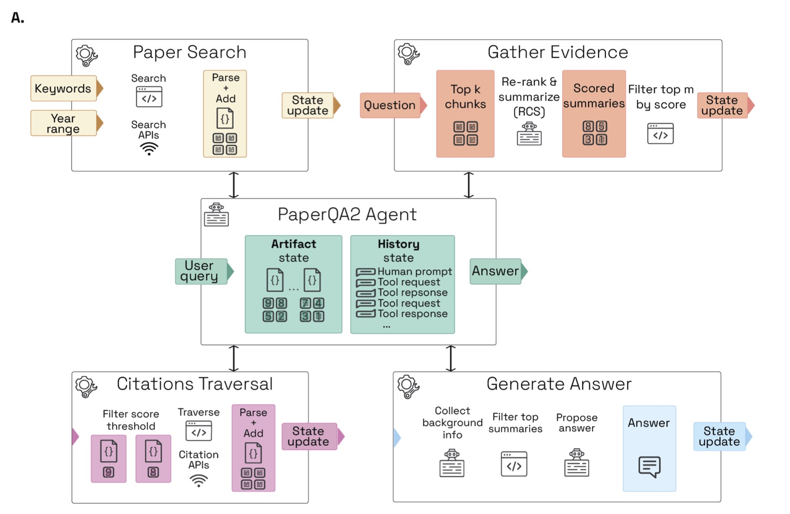
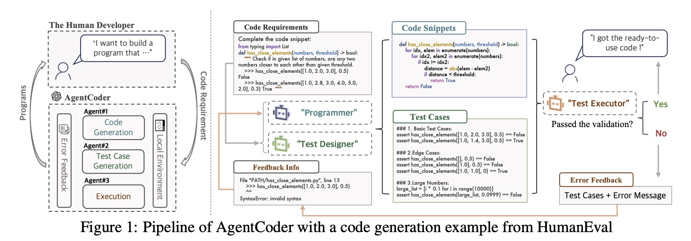
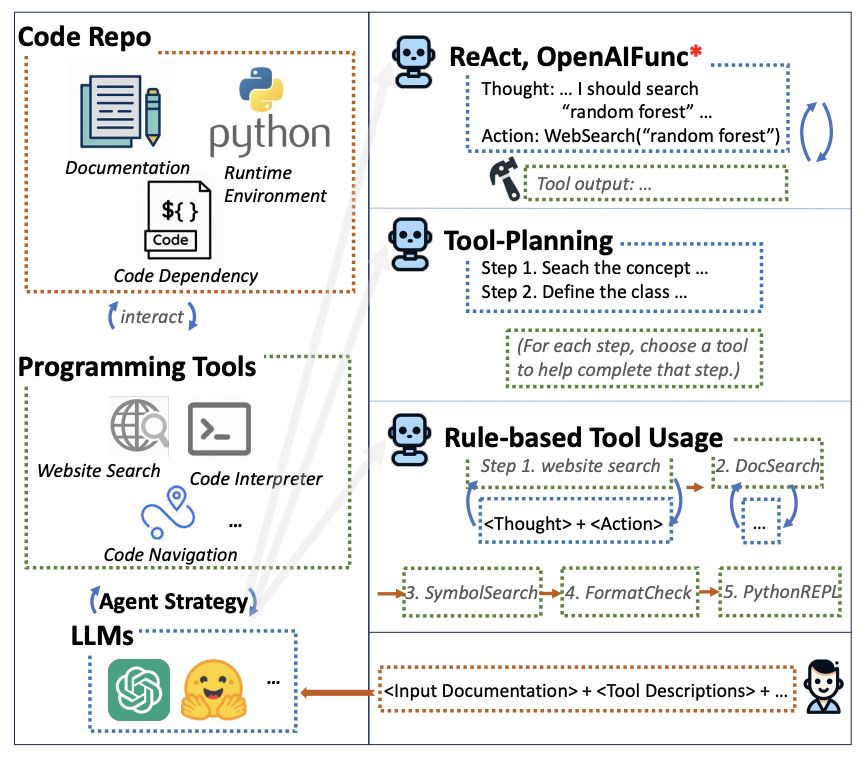

This is a list of relevant agents which I found (to learn what kind of solutions exist to help with design of our own agent)  

1. **ChatMOF** (https://github.com/Yeonghun1675/ChatMOF): I think this agent's architecture is very close to what I want to build. Apart from that an interesting feature is the presence of executer to execute the generated code (they generate code to extract the data from the database, we generate code to generate input files). I think it is a good way to verify correctness of the code: we may have a debugger agent which is able to correct mistakes if the code is not working (my experience with Chat GPT shows that it should work).

  

2. **PaperQA2** (https://github.com/Future-House/paper-qa):

  

3. **STORM** (https://github.com/stanford-oval/storm):
4. **ReAct** (https://arxiv.org/abs/2210.03629, implemented for example here https://github.com/langchain-ai/react-agent)
5. **AIOS** (https://arxiv.org/html/2403.16971v2): LLM Agent Operating System and **MemGPT** (https://arxiv.org/abs/2310.08560): Towards LLMs as Operating Systems (implemented as a package https://github.com/letta-ai/letta)
6. **AgentCoder** (https://arxiv.org/html/2312.13010v2)

  

7. **MapCoder** (https://github.com/Md-Ashraful-Pramanik/MapCoder)
8. **CodeAgent** (https://arxiv.org/pdf/2401.07339)

  

8. **LLaMP** (https://github.com/chiang-yuan/llamp)
