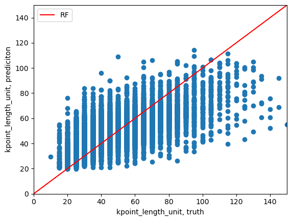
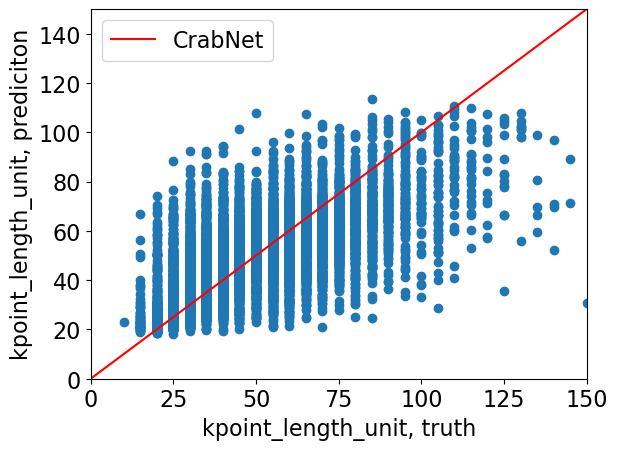
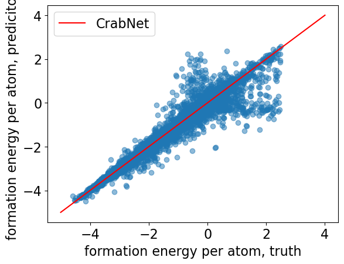
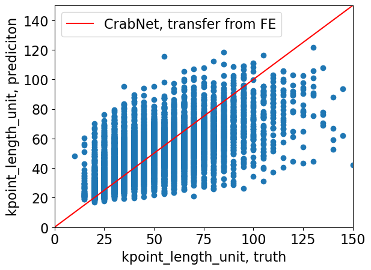
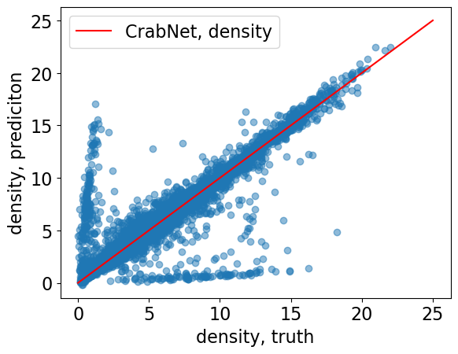

# Models to predict Kspacing from composition

Here some models for predicting kspacing from composition are collected. At the moment kspacing data are taken from Jarvis 3d_dft dataset.

## Random Forrest

  

R2=0.524, MAE=10.626

## CrabNet

  

R2=0.500, MAE=10.534

## CrabNet transfer from formation energy per one atom
Another idea I checked is to try to pre-train crabnet on formation energy and density. The idea is that both these datasets are larger and contain implicit information on the properties of atoms and compounds, and these datasets are larger..

For pre-training on formation energy I took the dataset from Matbench (to additionally check that I can achieve the same level of error with CrabNet as on Matbench). The result of pre-training is shown below. R2=0.96, MAE=0.0842 which is consistent with Matbench.

  

For transfer learning, I tried 2 approaches: (1) tuning all weights of CrabNet, (2) tuning only the weights of ResNet part. In both cases performance is the same as with no pre-training.

  

## CrabNet transfer from density
The density model was trained on the most recent MP data. Duplicates were removed. 

  

I tried the same approaches to transfer learning as with formation energy, and results were the same.

## Conclusion

All these models have approximately the same performance. And we would like to have something better.

Best trained models can be found in the goldilocks folder on sharepoint

It is also interesting to keep in mind that the jarvis leadearboard in terms of predicting this parameter can be found here https://pages.nist.gov/jarvis_leaderboard/AI/SinglePropertyPrediction/dft_3d_kpoint_length_unit/ . Interestingly, the best model shows MAE = 9.0 and the model is a matminer_xgboost (it is not clear which features they use, most probably just unit cell lengths, angels, space group number, and the unit cell volume).
